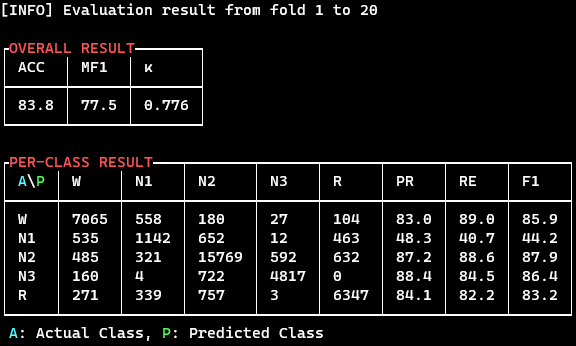

# IITNet

By *Hogeon Seo, *Seunghyeok Back, *Seongju Lee, Deokhwan Park, Tae Kim, and Kyoobin Lee (\*: Equal Contribution)

This repo is the official implementation of "***Intra- and Inter-epoch Temporal Context Network (IITNet) using Sub-epoch Features for Automatic Sleep Scoring on Raw Single-channel EEG***", Biomedical Signal Processing and Control 61 (2020): 102037. [[paper]](https://www.sciencedirect.com/science/article/pii/S1746809420301932) [](https://paperswithcode.com/sota/sleep-stage-detection-on-mass-ss2?p=intra-and-inter-epoch-temporal-context) [](https://paperswithcode.com/sota/sleep-stage-detection-on-sleep-edf?p=intra-and-inter-epoch-temporal-context)

The architecture of IITNet:


## Updates & TODO Lists
- [X] (2022.03.22) IITNet official repository is released.
- [ ] (2022.0X.XX) DeepSleepNet [1] baseline is added.

## Getting Started
### Environment 
* python >=3.7.0
* pytorch >= 1.7.0 (or compatible version to your develop env)
* numpy
* scikit-learn
* pandas
* mne
* terminaltables
* termcolor

1. Install PyTorch with compatible version to your develop env from [PyTorch official website](https://pytorch.org/).
2. Install remaining libraries using the following command.
    ```
    pip install -r requirements.txt
    ```


### Data Preparation
We evaluated our IITNet with MASS, SHHS, and Sleep-EDF dataset. You have to convert dataset from ```.edf``` into ```.npz``` format.

First, download ```.edf``` files and annotations MASS, SHHS, [Sleep-EDF](https://archive.physionet.org/physiobank/database/sleep-edfx/). For the MASS and SHHS dataset, you have to request for a permission to access their dataset.
You can download SC subjects of Sleep-EDF using the following commands.
```
cd data
chmod +x download_physionet.sh
./download_physionet.sh
```


Second, preprocess ```.edf``` into ```.npz``` format using the following command. We referred ```prepare_physionet.py``` in [DeepSleepNet](https://github.com/akaraspt/deepsleepnet) repository.
```
python prepare_physionet.py
```

After preprocessing, the hierarchy of ```./datasets/``` directory will be the following:

```
./datasets/
├── MASS/
│   └── F4-EOG/
│       ├── 01-03-0001-PSG.npz
│       ├── ...
│       └── 01-03-0064-PSG.npz
├── SHHS/
│   └── C4-A1/
│       ├── shhs1-200001.npz
│       ├── ...
│       └── shhs1-205804.npz
└── Sleep-EDF/
    └── Fpz-Cz/
        ├── SC4001E0.npz
        ├── ...
        └── SC4192E0.npz
```

Each ```.npz``` file contains input eeg epochs with the shape of ```(total_num_epochs, 30 * sampling_rate)``` and target labels with the shape of ```(total_num_epochs)``` with the key ```'x'``` and ```'y'```, respectively.

## Train & Evaluation
You can simply train and evaluate IITNet using just ```main.py```.
```
$ python main.py --config $CONFIG_PATH --gpu $GPU_IDs
```

For evaluation only, add ```--test-only``` argument when you run the script 


### Example Commands ###
* Train and Evaluation MASS (```L=1```) using single GPU (```gpu_id=0```)
```
$ python main.py --config ./configs/IITNet_MASS_SL-01.json --gpu 0
```
* Train and Evaluation Sleep-EDF (```L=10```) using multiple GPUs (```gpu_id=1,2```)
```
$ python main.py --config ./configs/IITNet_Sleep-EDF_SL-10.json --gpu 1,2
```
* Evalution trained SHHS (```L=10```) using single GPU (```gpu_id=3```)
```
$ python main.py --config ./configs/IITNet_SHHS_SL-10.json --gpu 3 --test-only
```

### Outputs ###
* For each fold, checkpoints that have the best validation loss are saved at ```./checkpoints/CONFIG_NAME/```.
* Overall result is written in ```./results/CONFIG_NAME.txt``` with the order of ```FOLD ACC MF1 KAPPA W-F1 N1-F1 N2-F1 N3-F1 REM-F1```.
* Overall and per-class results are printed like the following figures:



## Citation ##
If you find this project useful, we would be grateful if you cite our work as follows:

    @article{seo2020intra,
    title={Intra-and inter-epoch temporal context network (IITNet) using sub-epoch features for automatic sleep scoring on raw single-channel EEG},
    author={Seo, Hogeon and Back, Seunghyeok and Lee, Seongju and Park, Deokhwan and Kim, Tae and Lee, Kyoobin},
    journal={Biomedical Signal Processing and Control},
    volume={61},
    pages={102037},
    year={2020},
    publisher={Elsevier}
    }


## Acknowledgement ##
This work was supported by the Institute of Integrated Technology (IIT) Research Project through a grant provided by Gwangju Institute of Science and Technology (GIST) in 2019 (Project Code:
GK11470).

## Reference ##
```
[1] A. Supratak, H. Dong, C. Wu, and Y. Guo, “DeepSleepNet: A model for automatic sleep stage scoring based on raw single-channel EEG,” IEEE Trans. Neural Syst. Rehabil. Eng., vol. 25, no. 11, pp. 1998–2008, 2017.
```

## Licence ##
MIT licence
